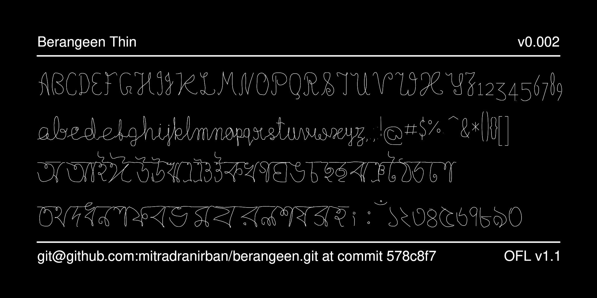

# Berangeen

 
[![][Fontbakery]](https://mitradranirban.github.io/berangeen/fontbakery/fontbakery-report.html)
[![][Universal]](https://mitradranirban.github.io/berangeen/fontbakery/fontbakery-report.html)
[![][Font File]](https://mitradranirban.github.io/berangeen/fontbakery/fontbakery-report.html)
[![][Repository]](https://mitradranirban.github.io/berangeen/fontbakery/fontbakery-report.html)
[![][OpenType]](https://mitradranirban.github.io/berangeen/fontbakery/fontbakery-report.html)

[Fontbakery]: https://img.shields.io/endpoint?url=https%3A%2F%2Fraw.githubusercontent.com%2Fmitradranirban%2Fberangeen%2Fgh-pages%2Fbadges%2Foverall.json
[Universal]: https://img.shields.io/endpoint?url=https%3A%2F%2Fraw.githubusercontent.com%2Fmitradranirban%2Fberangeen%2Fgh-pages%2Fbadges%2FUniversalProfileChecks.json
[Font File]: https://img.shields.io/endpoint?url=https%3A%2F%2Fraw.githubusercontent.com%2Fmitradranirban%2Fberangeen%2Fgh-pages%2Fbadges%2FFontFileChecks.json
[Repository]: https://img.shields.io/endpoint?url=https%3A%2F%2Fraw.githubusercontent.com%2Fmitradranirban%2Fberangeen%2Fgh-pages%2Fbadges%2FRepositoryChecks.json
[OpenType]: https://img.shields.io/endpoint?url=https%3A%2F%2Fraw.githubusercontent.com%2Fmitradranirban%2Fberangeen%2Fgh-pages%2Fbadges%2FOpenTypeSpecificationChecks.json

Berangeen is the monochrome static counterpart of Color Variable font [Rangeen](https://github.com/mitradranirban/rangeen)
It is available if two variants Rangeen Thick created from the Shadow Layer and Rangeen Thin created from the flair layer

## About

 
## Building

Fonts are built automatically by GitHub Actions - take a look in the "Actions" tab for the latest build.

If you want to build fonts manually on your own computer:

* `make build` will produce font files.
* `make test` will run [FontBakery](https://github.com/googlefonts/fontbakery)'s quality assurance tests.
* `make proof` will generate HTML proof files.

The proof files and QA tests are also available automatically via GitHub Actions - look at https://mitradranirban.github.io/berangeen.git.

## Changelog

 

** 5th January   2025. Version 0.002**
- First Pre-release 

## License

This Font Software is licensed under the SIL Open Font License, Version 1.1.
This license is available with a FAQ at https://openfontlicense.org

## Repository Layout

This font repository structure is inspired by [Unified Font Repository v0.3](https://github.com/unified-font-repository/Unified-Font-Repository), modified for the Google Fonts workflow.
